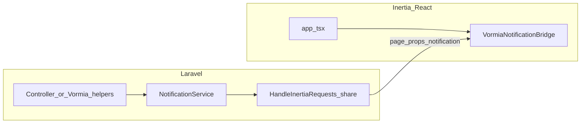

# Plan: `vormiaphp/vormia-inertia` + Inertia docs in repo

## Goals

- **Single install path**: one Artisan command (e.g. `php artisan vormia-inertia:install`) that registers middleware, publishes stubs, and prints exact **merge steps** for Vite/TS.
- **Notification helper**: bridge Vormia’s existing [`NotificationService`](src/Vormia/Services/NotificationService.php) (`NotificationService::current()` / session `notification` key) into **Inertia shared props** so React can show toasts/alerts once per navigation.
- **MediaForge**: document and optionally share **safe, minimal** props (e.g. `vormia.mediaforge` config subset or base public URL patterns) so React can build image URLs consistently with [`MediaForgeManager`](src/Vormia/Services/MediaForge/MediaForgeManager.php) / `config/vormia.php` — without duplicating business logic in JS.
- **Front-end stack**: treat **Tailwind 4 + shadcn + Wayfinder** as the default; installer copies/merges from your reference files [`inertia/vite.config.js`](inertia/vite.config.js) and [`inertia/tsconfig.json`](inertia/tsconfig.json).
- **Template updates**: package publishes an updated [`inertia/resources/js/app.tsx`](inertia/resources/js/app.tsx) pattern (full `createInertiaApp` + `createRoot` + optional global notification listener + default layout hook).
- **Interactive deps**: installer **asks** whether to **remove** jQuery, Select2, Flatpickr from `package.json` or **keep and isolate** them; same for **Flux** CSS (your current [`inertia/resources/css/app.css`](inertia/resources/css/app.css) has **no Flux** string — the doc will explain “remove if you add Livewire Flux” or “strip conflicting imports” when applicable).
- **Documentation**: add a **new `.md` file under [`inertia/`](inertia/)** (e.g. `inertia/VORMIA_INERTIA.md`) describing setup, merge instructions, and the jQuery/Flux decision tree.

## Package layout (new repo or monorepo subfolder)

- Composer package name: `vormiaphp/vormia-inertia`
- **require**: `vormiaphp/vormia`, `inertiajs/inertia-laravel`, `laravel/framework` (same range as core or `^12|^13`), PHP aligned with Vormia.
- **suggest**: `laravel/wayfinder` (recommended; matches your stack).
- **extra.laravel**: register `VormiaPHP\VormiaInertia\VormiaInertiaServiceProvider` (name TBD).
- **Stubs to publish** (non-destructive defaults + merge guidance):
  - `app/Http/Middleware/HandleInertiaRequests.php` extending `Inertia\Middleware`, `share()` returns at least:
    - `notification` => `NotificationService::current()` (or `null`)
    - Optional: small `vormia` array with MediaForge-related **public** hints from `config('vormia.mediaforge')` (disk, base paths) — **no secrets**.
  - `resources/js/app.tsx` (canonical template from this repo’s [`inertia/resources/js/app.tsx`](inertia/resources/js/app.tsx), extended with `createRoot`, `resolvePageComponent` or your existing `import.meta.glob` pattern, and a `<VormiaNotificationBridge />` stub using `@inertiajs/react` `usePage`).
  - Optional React component: `resources/js/vormia/components/VormiaNotifications.tsx` (shadcn toast or SweetAlert2 — your [`inertia/package.json`](inertia/package.json) already lists `sweetalert2`; pick one default and document the other as optional).

## One-command installer behavior

- Command: `vormia-inertia:install`
- Steps:
  1. Assert `vormiaphp/vormia` is installed and config published if needed (print `vendor:publish` tag if missing).
  2. Publish middleware + JS stubs (with `--force` only when user confirms overwrite).
  3. Register middleware in `bootstrap/app.php` (Laravel 11+) or `app/Http/Kernel.php` (if still used) — document both in the MD file.
  4. **Prompts** (via Laravel `confirm` / `choice`):
     - **jQuery / Select2 / Flatpickr**:
       - **Remove** (default recommendation): strip from `package.json` template and remove any CSS imports that exist only for legacy plugins.
       - **Keep but isolate**: keep deps, add doc section: load only inside specific Blade islands or lazy-init in a named container; **never** bind global `$` handlers on `document` for Inertia navigations; prefer React components for date/select.
     - **Flux CSS**: if user uses **Livewire Flux** in the same app, ask whether to **exclude Flux styles** from the Inertia bundle or keep a separate Vite entry — document conflict patterns (global CSS vs scoped layouts).
  5. Print **post-install checklist**: `npm install`, `php artisan wayfinder:generate` (if Wayfinder present), `npm run build`.

## Docs file in this repo

- Add [`inertia/VORMIA_INERTIA.md`](inertia/VORMIA_INERTIA.md) (name can match your preference) containing:
  - **Copy/merge** [`inertia/tsconfig.json`](inertia/tsconfig.json): `@/*` → `resources/js/*`, `include` globs.
  - **Copy/merge** [`inertia/vite.config.js`](inertia/vite.config.js): `laravel-vite-plugin` inputs, `@tailwindcss/vite`, `@vitejs/plugin-react`, `@inertiajs/vite`, `wayfinder()` plugin, `@` alias.
  - **Notification flow** diagram (mermaid): Controller → `NotificationService::flash()` / session → `HandleInertiaRequests` share → React `usePage().props.notification`.
  - **MediaForge**: link to Laravel filesystem docs + Vormia `config/vormia.php` keys; show PHP example `MediaForge::url(...)` vs passing **already-resolved URL strings** in Inertia props (preferred for SPA).
  - **jQuery / Flux** sections reflecting the prompts above.

## Files in _this_ repo to align (when you switch to Agent mode)

- Update published templates to match the package stubs: [`inertia/resources/js/app.tsx`](inertia/resources/js/app.tsx), [`inertia/resources/css/app.css`](inertia/resources/css/app.css) (only if installer/doc defines optional strips).
- Add the new markdown at [`inertia/VORMIA_INERTIA.md`](inertia/VORMIA_INERTIA.md).

## Notes / constraints

- **Do not** add `"version"` in the new package’s `composer.json` (per your rule); rely on git tags.
- **No default seeding** in installers.
- Keep **core** `vormiaphp/vormia` free of Inertia/npm deps; all Inertia-specific code lives in `vormiaphp/vormia-inertia`.

